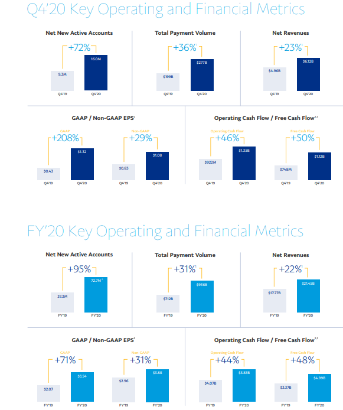

# FinTech Case Study

## Looking at how PayPal utilises Fintech using payment services.

#  Paypal

* Paypal was incorpoated on December 1998 PayPal. Paypal was founded in 1998 by technology entrepreneurs Peter Thiel and Max Levchin. Instead, the company's initial name was Confinity, a company founded on the premise of low-cost, almost effortless online digital payments via the web. Having the ability of sending and receiving payments and transactions online between individuals for consumers and businesses as an alternative to traditonal banking methods with transcation fees. The company aimed to provide secure software for financial transactions on individually owned devices using their computer via the web and and mobile phone using an app in the future. Paypal expanded to develop a digital wallet to consumers and businesses. In 2000 PayPal name was officially launched publicly.

* The idea of the Paypal orginated from a speech Peter Thiel was giving at Standford University. After the speech Max Levchin was introduced to Thiel. The two hit it off so well that Thiel recommended they would get together the next day. Over breakfast, Max Levchin share his concept of Paypal. Thiel told Levchin that he would invest in Levchin's ideas for a start-up: knowns Confinity, a company that would develop encryption and security for handheld devices, enabling the digital transfer of money. Just a few weeks later, both agreed it would stand a greater chance of success if Thiel joined the company as its CEO. 

* The originally start up funding came from founder Peter Thiel who ran a small hedge fund call Thiel Capital provided a small amount of initial capital. The first outside round of funding came from Nokia Ventures (now Blue Run Ventures) The funding was estimated at $3 Million Series A in 1999. 

## PayPal Business Activities:

* The financial problem Paypal was trying to solve, was to provide a secure, simple and efficient way to transfer money using digital platform, using both the web using a computer and mobile phone app. The main goal was to provide a secure simple digtial wallet to store money,to insantly make transctions, to instantly make purchases and instantly transfer money at low costs.PayPal offered a solution of online payments system and online money transfer system as an alternative to traditional paper methods like checks and money orders and manual bank transfers.

* Paypal's intended customers is a two sided platform. On one side, there are merchants, for businesses to use PayPal services in order to make financial transactions with consumers and other businesses, with security and trust. On the other side, are the consumers, who make payments and transactions through the PayPal platform with security and trusts, within the merchants’ websites.The PayPal system was very attractive to auction sellers, most of which were individuals or small businesses that were unable to accept credit cards, and for consumers as well. In fact, many sellers could not qualify for a credit card Merchant account because they lacked a commercial credit history. The service also appealed to auction buyers and consumers, because they could fund PayPal accounts using credit cards or bank account balances, without divulging credit card numbers to unknown sellers that lacked commerical credit history.

* The size of market for customers for is estimated for 2021 to be over 2.14 billion people worldwide are expected to buy goods and services.PayPal has 377 million active customers for 2020. Percantage of online buyers, 87.5% of e-commerce buyers use PayPal services. Conducting further reseach with Paypal have a large ranges of services is hard to ascetain an exact market size of customers as the rapid growth of online users is an unlimited scale growing 30% yearly.

* Going back to when Paypal first originally started Levchin created an algorithm, which he nicknamed Igor after a Russian hacker in the habit of taunting the company, to flag activity that was characteristic of fraudulent actions. This gave Paypal an advantage offering a defense mechanism against fraudulent activity.
Levchin also developed CAPTCHA technology, where human users must type the random characters appearing in a box to prove that they are not bots with fake account.
The advantage PayPal had, was providing security and minimising fraud to their merchants and consumers. The other advantages Paypal had was market share monolopy being able to provide services to a large volume of merchants and consumers. Paypal offered an advantage of using once account to make purchases, transactions, transfer money. One of the unique features about PayPal is that account holders can use its services across devices, operating systems, retailers, or banks. This not only gives PayPal a leg up on competition in the P2P space from Apple and Zelle, but other competitors' payment platforms like Samsung's Samsung Pay, Alphabet's Android Pay, Amazon's, Pay with Amazon, and Wal-Mart's Walmart Pay as well.
In the P2P payment space, this directly affects how useful the service is. For instance, if a dinner party wants to split a restaurant bill, every person paying would have to have an iPhone to use Apple's service. With Zelle, everyone would need to be a member of a participating bank or credit union. Not so with PayPal. In other words, PayPal is completely agnostic about what phone its account holders use or where they bank and shop; a claim few of its rivals can make.

* Going back to the origins of PayPal their original competitors were Competitors such as Billpoint, Citigroup's C2It, and Western Union's MoneyZap X.com.In March 2000, PayPal merged with another fintech start-up, X.com, which was actively experimenting with online banking applications.

* Levchin created an algorithm, which he nicknamed Igor after a Russian hacker in the habit of taunting the company, to flag activity that was characteristic of fraudulent actions.
Levchin also developed CAPTCHA technology, where human users must type the random characters appearing in a box to prove that they are not bots with fake account.

* In the first phase, payment volumes were coming mostly from the eBay auction website. The system was very attractive to auction sellers, most of which were individuals or small businesses that were unable to accept credit cards, and for consumers as well. In fact, many sellers could not qualify for a credit card Merchant account because they lacked a commercial credit history. The PayPal service also appealed to auction buyers because they could fund PayPal accounts using credit cards or bank account balances, without divulging credit card numbers to unknown sellers. PayPal employed an aggressive marketing campaign to accelerate its growth, depositing $10 in new users' PayPal accounts.

* Paypal uses API The NVP/SOAP APIs offer interfaces that cover all aspects of complex business transactions, including invoicing services, notifications, subscription services, parallel payments, permissions services, and functionality to processes refunds.Paypal felt that apache flow and Apache Gobblin offers the most features, and provides flexibility and space for us to build our next-gen data movement platform.Paypal also use DAG Direct acronym graphs. Directed Acyclic Graph (DAG) ledger is a “directed graph” data structure that uses the method of topological ordering to verify transactions. The “directed graph” method requires every node that is wishing to perform a transaction to first verify the previous transactions of two other nodes as well. What makes this topological sequence so efficient is that the order verified transactions can only go from earlier in time to the most recent. Additonal technology Paypal used is MYSQL is an open-source relational database management system. A relational database organizes data into one or more data tables in which data types may be related to each other; these relations help structure the data. SQL is a language programmers use to create, modify and extract data from the relational database, as well as control user access to the database. Paypal used this platform due to the ability to support transactions (and roll them back), and an ability to write data to the database and read it anywhere else in the world in under one second. 
Paypal uses Payflow they created that generate ACH When Paypal connects to a bank account for either payments or deposits, it uses an electronic interface operated by the Federal Reserve; this interface is known as the automated clearing house (ACH). When Paypal initiates a transaction, it assumes the role of originating depository financial institution in the ACH transaction. Paypal sends an electronic request for funds or notice of deposit through the ACH system to the user’s bank, and the linked bank account responds with confirmation. Funds transferred through the ACH take three to five business days to settle.

This is a reference list of technologies used by paypal https://w3techs.com/sites/info/paypal.com

* Due the size of Paypal's evolution in growth, in summary it's near impossible to name all the technologies used by Paypal and piece them together. The reason for my response is from the hours of research I have done drawn me to the conclusion it's near impossible to scale the technologies used. My question is what fintech doesn't PaypPal use? PayPal are basically a master mind behind fintech today.

## PayPal Landscape:

Paypal domain operates in one of the best-known domians of digital payments platforms, enabling both merchants and consumers to make digital and mobile payments worldwide.
* Over the past 5 to 10 year the types of trends and innovations evolving. Snap Shop, A new ecommerce trend of image shopping will emerge. Users will point their camera towards a product they see to order it from an online store. Social payments. Popularized by Paypal, social payments allow users to transfer funds using social media. Post Payment This allows the customer to recieve merchandise and pay later. After pay. Pay first installments on puchase and another three payments every 2 weeks. B2B is business to business transfers. Mobile shopping making purchases through a mobile phone app.Shopify allowing to setup an online shop to sell products and servicecvia your mobile phone. 

* Paypal is the major company in their domain, banks, credit unions etc work with Paypal not really consider a competitor.

* PayPal as core metrics uses Non GAAP known as TPV (Total Payments Volume),the total dollar value of transactions conducted through PayPal's payments platform. In PayPal's case, management supports TPV by paying close attention to two other key metrics the company furnishes to investors on a quarterly basis: active customer accounts, and payment transactions per active account. The other metric is GAAP for Share holders. Paypal provide a metric comparsion between.

 # Reference of Metrics :
  Q4’20: Outstanding finish to a record year.
• Total Payment Volume (TPV) of $277 billion, growing 39%, and 36% on an FX-neutral basis (FXN); revenue of $6.12 billion, growing 23% on a spot and FXN basis.
• GAAP EPS of $1.32, up 208% and non-GAAP EPS of $1.08, up 29%.
• Added 16.0 million Net New Active Accounts (NNAs).
FY’20: Strongest performance in PayPal’s history.
• TPV of $936 billion, growing 31% on a spot and FXN basis; revenue of $21.45 billion, growing 21%, and 22% FXN.
• GAAP EPS of $3.54, up 71% and non-GAAP EPS of $3.88, up 31%.
• ~$5.9 billion in Operating Cash Flow and ~$5.0 billion in Free Cash Flow.
• Added 72.7 million NNAs.
FY’21: Expect ongoing momentum with strong TPV growth and NNAs.
• TPV expected to grow in the high 20’s on a percentage basis for the year.
• Revenue expected to grow ~19% at current spot rates and ~17% on an FXN basis, to approximately ~$25.5 billion investments; non-GAAP EPS is expected to grow ~17%
• ~50 million NNAs expected to be added to PayPal’s platform in FY’21.
• TPV of $936 billion, growing 31% on a spot and FXN basis; revenue of $21.45 billion, growing 21%, and 22% FXN.
• GAAP EPS of $3.54, up 71% and non-GAAP EPS of $3.88, up 31%.
• ~$5.9 billion in Operating Cash Flow and ~$5.0 billion in Free Cash Flow.
• Added 72.7 million NNAs.
* Below is a graph using their Core Metrics.

## My Reccomendations

* A solution and recommendation I would suggest to PayPal is a text bot. What i noticed is threre is no search engine bar on the front end of the website. Inaddition if you need futher assistance with your PayPal account you have to scoll through pages of information to a solution to your problem. Also I found the soultions offered with a series of question's doesn't offer a resolution to more technical problem or complicated account problem or issues. Eg Being locked out of your account from being arrears. Paypal solutions command you to log into your account and the services are within the account. There is no external feature on the front end to address these issues. By Paypal introducing a text bot you could type in your issues or what you seek and the bot can direct to the page. Also the text bot could identify if you need to speak to PayPal representative and provide a number to call or notify a representative to contact you.In addtion the text bot could direct you which department to email. 
If Paypal introduce the text bot would increase customer satisfaction in having their problems resolved. This would also resolve payment disputes faster rather than referring these disputes to a third part to collect money in arrears simply due a cusotmer is simply locked out of their account. Paypal would increase revenue by not having to pay a third party company for collection fees. In addition Revenue can be increased by faster resolutions so customers having issues can return as fast as possible making transactions through Paypal.

## Resources
https://www.thestreet.com/technology/history-of-paypal-15062744
https://medium.com/@bharath.bkj/the-story-of-paypal-b708efe83064
https://en.wikipedia.org/wiki/PayPal#:~:text=Timeline%20of%20PayPal-,Early%20history,security%20software%20for%20handheld%20devices.&text=In%20October%20of%20that%20year,operations%20and%20focus%20on%20PayPal
http://www.ecommerce-digest.com/paypal-case-study.html
https://medium.com/@bharath.bkj/the-story-of-paypal-b708efe83064
https://richtopia.com/companies/history-paypal-infographic-included/
https://www.thestreet.com/technology/history-of-paypal-15062744
https://www.investopedia.com/articles/company-insights/082416/top-5-companies-owned-paypal-pypl.asp
https://www.marketing91.com/marketing-strategy-paypal/
https://businessmodelanalyst.com/paypal-business-model/
https://capitalcounselor.com/paypal-statistics/
https://spendmenot.com/blog/paypal-statistics/
https://www.investopedia.com/how-paypal-makes-money-5094794
https://medium.com/paypal-tech/how-paypal-moves-secure-and-encrypted-data-across-security-zones-10010c1788ce
https://developer.paypal.com/docs/paypal-payments-standard/integration-guide/ProfileAndTools/
https://developer.paypal.com/docs/paypal-payments-standard/integration-guide/ProfileAndTools/
https://www.dwolla.com/updates/bank-transfers-using-a-payment-api/
https://www.patriotsoftware.com/payroll/training/definition/nacha-file-ach-file/#:~:text=NACHA%20File%2FACH
https://fin.plaid.com/articles/how-does-paypal-work/#:~:text=At%20its%20most%20basic%2C%20PayPal,of%
https://www.quora.com/How-did-PayPal-get-seed-funding
https://www.fool.com/investing/2017/06/29/paypal-isnt-scared-of-the-competition.aspx
https://www.fool.com/investing/complete-paypal-stock-history.aspx
https://www.businessofapps.com/data/paypal-statistics/
https://spendmenot.com/blog/paypal-statistics/
https://capitalcounselor.com/paypal-statistics/#:~:text=PayPal%20had%20337%20million%20active,active%20user%20account%20in%202020
https://richtopia.com/companies/history-paypal-infographic-included/
https://medium.com/@bharath.bkj/the-story-of-paypal-b708efe83064
Elasticsearch: What it is, How it works, and what it’s used for (knowi.com)
PayPal Standardizes on Apache Airflow and Apache Gobblin for Its Next-Gen Data Movement Platform (infoq.com)
Apache Hadoop - Wikipedia
